<div align="center">

# ⛵ 돛단배 (Sailboat)

**유리병에 마음을 담아 바다에 띄우면, 낯선 누군가에게 우연히 닿는 익명 편지 앱**

[](https://react.dev)
[](https://www.typescriptlang.org)
[](https://vitejs.dev)
[](https://supabase.com)
[](https://apps-in-toss.toss.im)

토스 앱 속에서 동작하는 **WebView 미니앱**이에요. 누가 받을지 모르기에 더 솔직해지는, 1회성 익명 편지 서비스를 지향해요.

<br />

### 🎬 데모

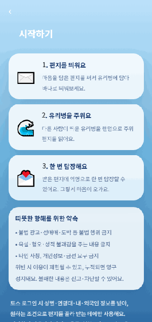

<sub>온보딩 → 받을 사람 선택 → 편지 작성·전송 → 받은 편지 읽기 → 답장 → 답장함</sub>

</div>

---

## 📑 목차

- [한눈에 보기](#-한눈에-보기)
- [스크린샷](#-스크린샷)
- [핵심 기능](#-핵심-기능)
- [기술 스택](#-기술-스택)
- [아키텍처](#-아키텍처)
- [데이터 모델](#-데이터-모델)
- [엔지니어링 하이라이트](#-엔지니어링-하이라이트)
- [안전·신뢰 설계](#-안전신뢰-설계)
- [로컬 실행](#-로컬-실행)
- [프로젝트 구조](#-프로젝트-구조)
- [로드맵](#-로드맵)

---

## 🌊 한눈에 보기

> 편지를 쓰면 **보내는 순간** 시스템이 무작위 수신자를 골라 전달해요(pull이 아닌 push 방식).
> 받은 사람은 **딱 한 번** 답장할 수 있고, 그 답장이 닿으면 교류는 자연스럽게 마무리돼요.

| | |
|---|---|
| **무엇을** | 익명 1:N 편지 + 1회 답장 서비스 |
| **어디서** | 토스 앱 내 미니앱 (3,000만 토스 유저 노출) |
| **왜** | 익명성이 주는 솔직함과 우연한 연결의 따뜻함 |
| **누가** | 1인 기획·개발 (프론트엔드 + 백엔드 + 인프라 + 운영 정책) |

---

## 📸 스크린샷

| 온보딩 | 홈 | 편지 쓰기 | 받은 편지 |
|:---:|:---:|:---:|:---:|
| 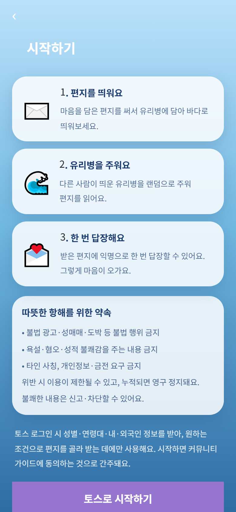 | 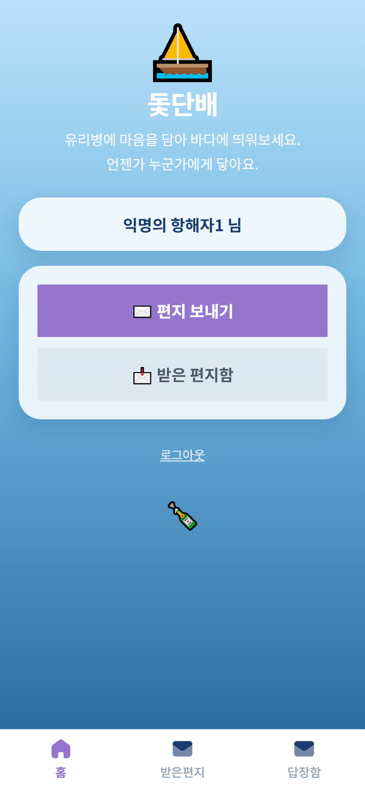 | 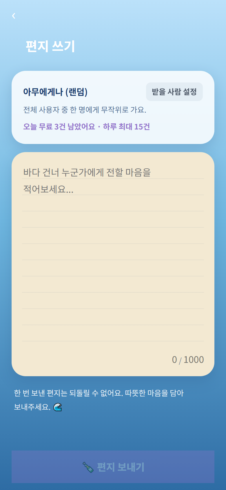 | 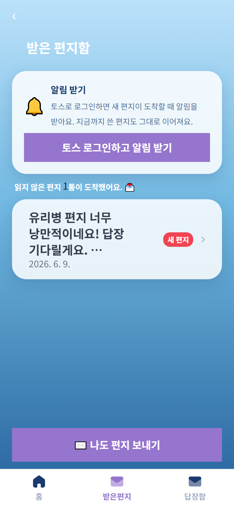 |

| 편지 읽기 | 답장 쓰기 | 답장함 | 위기 지원 |
|:---:|:---:|:---:|:---:|
| 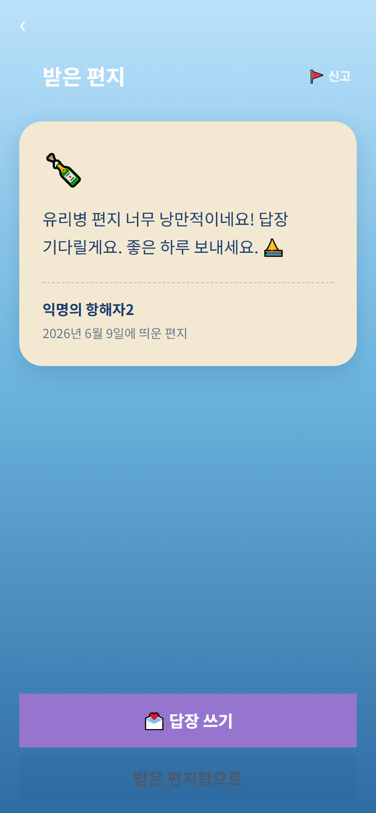 | 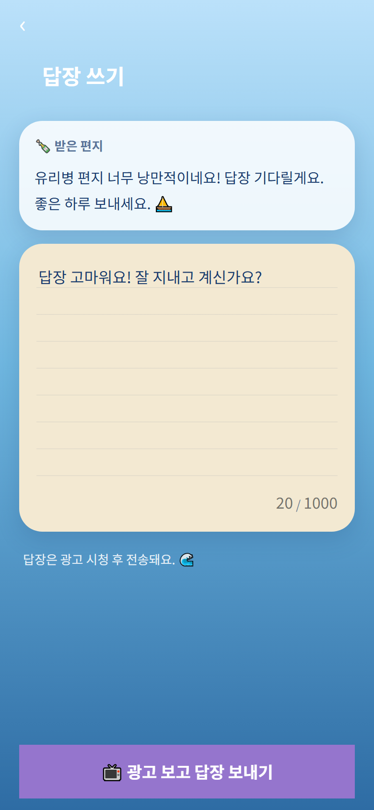 | 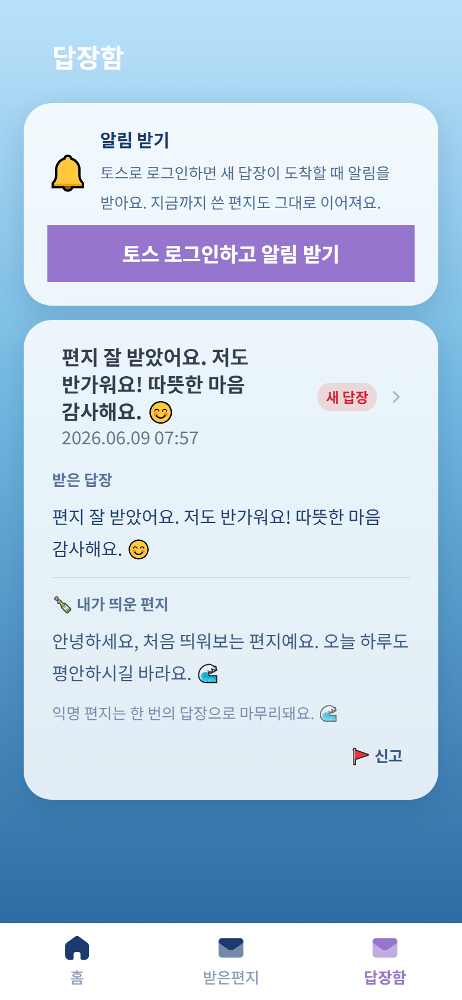 | 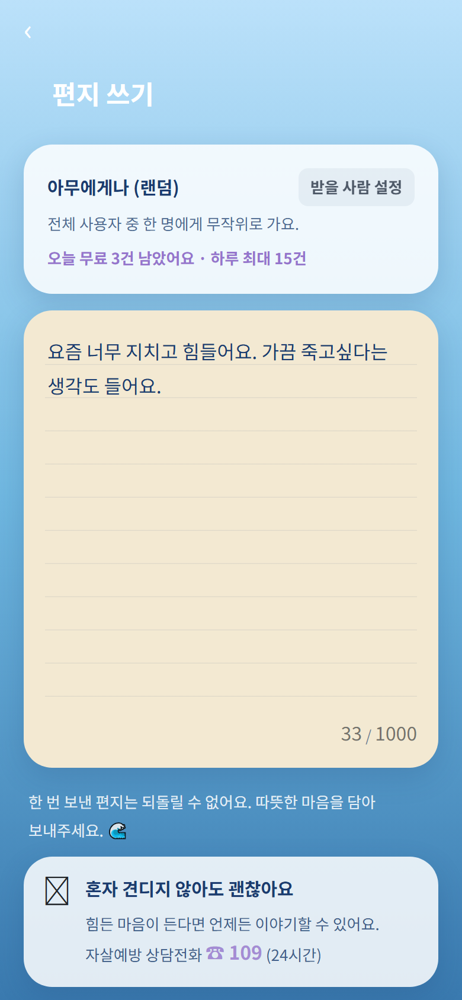 |

---

## ✨ 핵심 기능

- **무작위 편지 전달** — 보내는 순간 서버 RPC가 수신자를 무작위 배정 (전체 또는 조건 타겟 중에서)
- **조건 필터링** — 토스 로그인 동의로 받은 성별·연령대·내/외국인 정보로 "받을 사람" 범위 지정
- **1회 답장** — 받은 편지에 익명으로 한 번 회신, 지속 대화는 의도적으로 배제
- **전송 쿼터 & 광고 게이트** — 무료 3통 / 하루 10통, 이후 **공유하고 광고 보면 +1통** (하루 최대 15통)
- **실시간 도착 반영** — Supabase Realtime으로 받은 편지함 즉시 갱신
- **신고·차단·자동 숨김** — 누적 신고 3회 시 콘텐츠 자동 비공개
- **위기 신호 감지** — 자해·위기 키워드 감지 시 상담 안내 배너 노출
- **회원 탈퇴 콜백** — 토스 "연결 끊기" 시 Edge Function이 모든 데이터 cascade 삭제

---

## 🛠 기술 스택

| 영역 | 사용 기술 |
|---|---|
| **언어** | TypeScript 5.7 (strict) |
| **프론트엔드** | React 18, Vite 6, Emotion |
| **디자인 시스템** | TDS Mobile (토스 디자인 시스템) |
| **플랫폼 SDK** | `@apps-in-toss/web-framework` (Granite 런타임 · WebView 브릿지) |
| **백엔드** | Supabase — Postgres, Row Level Security, Realtime, Edge Functions(Deno) |
| **인증** | 토스 OAuth(`appLogin`) → Edge Function에서 mTLS 토큰 교환 + AES-256-GCM 개인정보 복호화 → Supabase 세션 발급 |
| **품질** | ESLint(flat config), Prettier, Playwright(E2E 스크린샷 회귀) |
| **CI/배포** | `ait build` → `.ait` 아티팩트 → `ait deploy` (앱인토스 콘솔) |

---

## 🏗 아키텍처

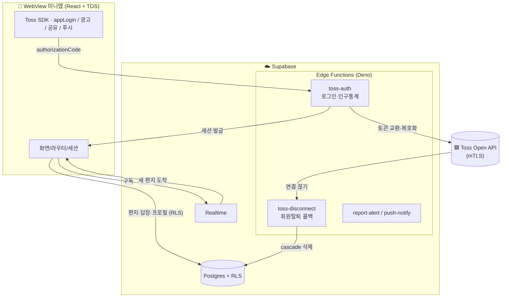

**설계 의도**
- **클라이언트는 RLS 뒤에서만 DB 접근** — `anon key`는 공개돼도 안전하고, 모든 권한은 Postgres 정책으로 강제
- **민감 로직은 서버 RPC/Edge Function으로 격리** — 무작위 배정·쿼터·복호화·제재는 클라이언트가 위·변조 불가
- **푸시(pull) 대신 푸시(push) 모델** — 편지는 보내는 순간 수신자가 정해져, 받은 편지함은 단순 조회만

---

## 🗄 데이터 모델

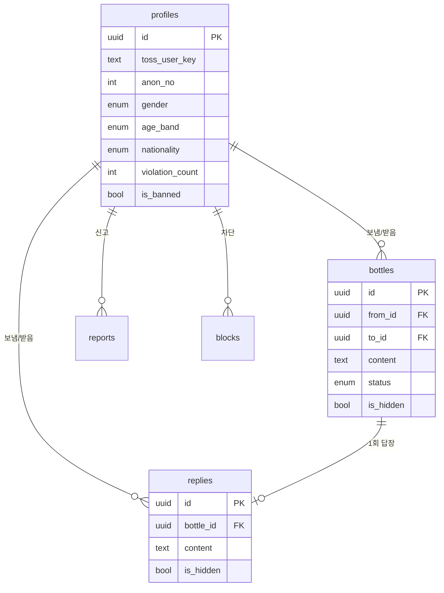

스키마·정책·RPC는 `supabase/migrations/`에 버전 관리돼요 (0001~0012). RLS, 무작위 매칭 RPC, 전송 쿼터, 신고 임계 자동 숨김, Realtime 설정이 모두 마이그레이션으로 재현 가능해요.

---

## 💡 엔지니어링 하이라이트

<details open>
<summary><b>1. 서버에서 강제하는 전송 쿼터 & 공유 리워드</b></summary>

> 무료 3통 / 하루 10통, 이후엔 공유+광고로 +1통(최대 15통). 한도 검사를 **클라이언트가 아닌 Postgres 함수(`send_bottle`)에서** 수행해 우회를 차단했어요. KST 자정 기준 일일 카운트도 SQL에서 계산해요.
</details>

<details>
<summary><b>2. mTLS + AES-256-GCM 개인정보 복호화 파이프라인</b></summary>

> 토스 Open API는 mTLS 필수이고 성별·생년월일·내외국인 정보가 암호화돼 와요. Edge Function에서 토큰 교환 → 암호문(IV 12B + 본문 + 태그 16B, base64) → AES-256-GCM 복호화 → 연령 밴드 변환까지 처리해요. 시크릿이 없으면 자동으로 개발용 mock으로 동작하도록 설계해 로컬 개발을 막지 않아요.
</details>

<details>
<summary><b>3. URL 없는 스택 기반 인앱 라우터</b></summary>

> WebView 미니앱 특성상 브라우저 히스토리 대신, 토스 네이티브 바의 back 이벤트(`graniteEvent`)와 연동되는 가벼운 스택 라우터를 직접 구현했어요. 루트에서 뒤로가기 시 `closeView()`로 미니앱을 닫아요.
</details>

<details>
<summary><b>4. dvh 기반 안전한 레이아웃</b></summary>

> 상태바·하단탭이 있는 WebView에서 `100vh` 중복으로 생기던 전체 스크롤 문제를, `height:100dvh + overflow:hidden`(셸)과 `height:100%`(화면) + `env(safe-area-inset-*)` 패딩으로 해결했어요.
</details>

<details>
<summary><b>5. Playwright 기반 시각 회귀 검증</b></summary>

> 실제 두 사용자(A↔B) 플로우를 자동으로 돌려 전 화면을 캡처하는 스크립트(`scripts/screenshots.mjs`)로, 기능 변경 후 UI를 빠르게 검증해요.
</details>

---

## 🛡 안전·신뢰 설계

익명 서비스에서 가장 중요한 건 안전이에요. 다음을 기본 탑재했어요.

- **금칙어 필터** — 불법 광고·성매매·도박 등 차단
- **개인정보 경고** — 전화번호·계좌·SNS 아이디 패턴 감지 시 전송 전 확인
- **신고 & 차단** — 차단된 상대와는 편지·답장이 오가지 않도록 RLS 가드
- **누적 신고 자동 숨김** — 서로 다른 신고자 3명 이상이면 콘텐츠 자동 비공개
- **위기 개입** — 자해·위기 신호 감지 시 상담 핫라인 안내
- **연령 정책** — 앱인토스 정책에 따라 만 19세 이상 제공

운영 정책·모니터링 기준은 `docs/`(MODERATION_RUNBOOK, MONITORING_POLICY)에 문서화돼 있어요.

---

## 🚀 로컬 실행

```bash
# 1. 설치
npm install

# 2. 환경 변수 (값은 .env.example 참고 — 비워둬도 '둘러보기'로 흐름 확인 가능)
cp .env.example .env

# 3. 개발 서버
npm run dev
```

백엔드(Supabase) 연동, 토스 로그인(mTLS), 배포까지의 전체 절차는 **[`SETUP.md`](SETUP.md)** 에 단계별로 정리돼 있어요.

```bash
npm run build   # vite 빌드 → .ait 아티팩트
npm run deploy  # 앱인토스 콘솔로 배포
```

---

## 📂 프로젝트 구조

```
src/
├─ lib/            env · supabase 클라이언트 · analytics · tossEnv
├─ data/           Supabase 접근 계층 (bottles · replies · profile · auth · moderation · share)
├─ hooks/          useAdGate (광고 보고 → 실행 게이트)
├─ router.tsx      URL 없는 스택 라우터
├─ session.tsx     로그인 세션 컨텍스트
├─ components/      ScreenLayout · BottomNav
└─ features/        화면별 모듈 (home · onboarding · compose · receive · filter · reply · replies · safety · moderation)

supabase/
├─ migrations/     스키마 + RLS + RPC + Realtime (0001~0012)
└─ functions/      toss-auth · toss-disconnect · report-alert · push-notify

scripts/           Playwright E2E·스크린샷 자동화
docs/              운영 정책 · 모니터링 · 셋업 가이드
```

---

## 🗺 로드맵

- [ ] 실 mTLS 인증서 연동 (현재 인구통계는 개발용 mock)
- [ ] 인앱 광고 그룹 ID 연결 → 광고 수익화 활성화
- [ ] 데일리 리마인드 푸시 (스마트 발송 템플릿)
- [ ] 거리 기반 필터(마지막 위치 저장) 검토

---

<div align="center">

**개인 포트폴리오 목적으로 공개한 저장소예요.**
앱인토스 미니앱 · Supabase 풀스택 · 운영 정책까지 1인 개발한 사례로 봐주세요. ⛵

</div>
